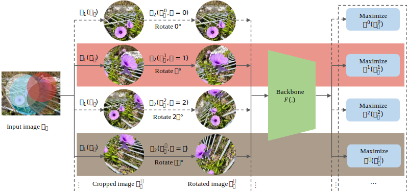
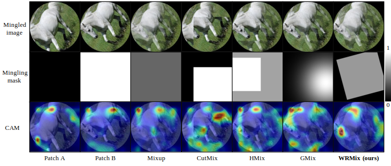

# FullRot_WRMix
The official implementation of FullRot + WRMix provides a comprehensive set of functions for deep learning and computer vision tasks. It includes features such as training process printing, log saving, and computation and storage of standard metrics for classification, sementic segmentaion, and object detection tasks.

## Installation

For instructions on how to install the FullRot_WRMix implementation, please refer to [INSTALL.md](readme/INSTALL.md) file.

## Benchmark and Evaluation

To prepare the datasets required for benchmark evaluation and training, please consult the [DATA.md](readme/DATA.md) file. 

For pre-training the resnet50 model using self-supervised learning, you can follow the settings provided in [main.sh](shell/main.sh) script. Additionally, we provides downstream task training settings in the [downstream_example.sh](shell/downstream_example.sh) script.

### *Classification results on STL-10, CIFAR-10/100, PAD-UFES-20*  

 

### *Semantic segmentaion results on PASCAL VOC 2012 and ISIC 2018*  

 

### *Object Detection results on PASCAL VOC 2007*  

 

### Ablation study
For the training settings of the ablation study and extracurricular experiemnts, please refer to the [ablation.sh](shell/ablation.sh) and [ablation_extra.sh](shell/ablation_extra.sh) scripts.

## Citation

If you find this implementation useful in your research, we kindly request that you consider citing our paper as follows:

    @article{dai4495231any,
      title={Any Region Can Be Perceived Equally and Effectively on Rotation Pretext Task Using Full Rotation and Weighted-Region Mixture},
      author={Dai, Wei and Wu, Tianyi and Liu, Rui and Wang, Min and Yin, Jianqin and Liu, Jun},
      journal={Available at SSRN 4495231}
    }
